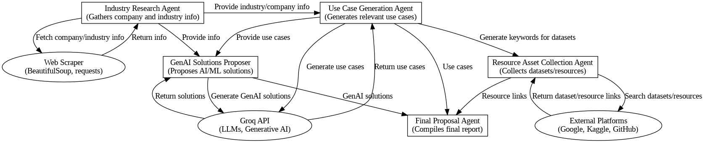

# AI Proposal Generator

This repository contains an automated system for generating AI-driven business proposals using various agents and large language models (LLMs). The system leverages tools like LangChain, transformers, and APIs to streamline the proposal creation process.

## Overview

The AI Proposal Generator automates the process of creating detailed business proposals by:
- Collecting company and industry information.
- Generating relevant use cases based on trends and requirements.
- Proposing AI/ML solutions tailored to the company’s needs.
- Collecting relevant datasets and resources.
- Compiling all the information into a structured final report.

## How It Works

1. **Industry Research Agent**:
   - Gathers information about the company and industry through web scraping.

2. **Use Case Generation Agent**:
   - Analyzes trends and generates use cases leveraging LLMs.

3. **Resource Asset Collection Agent**:
   - Searches platforms like Kaggle and GitHub for relevant datasets.

4. **GenAI Solutions Proposer Agent**:
   - Proposes solutions using generative AI technologies.

5. **Final Proposal Agent**:
   - Compiles everything into a structured markdown report.

## Inputs

- **Company Name**: The name of the company for which the proposal is being generated.
- **Industry**: The industry related to the company (e.g., Retail, Healthcare, Finance).

## Outputs

- **Generated Proposal**: A markdown file (`final_proposal.md`) that includes:
  - Top use cases for AI/ML in the specified industry.
  - Relevant datasets and resource links.
  - Proposed solutions using Generative AI and LLMs.

## System Architecture

## What to Expect

- **Step-by-Step Execution**: The notebook guides you through each stage of the process.
- **Comprehensive Report**: A detailed markdown file with actionable AI/ML insights and recommendations.
- **Resource Links**: A detailed file consisiting of the resources used.

Feel free to explore, modify, and enhance the system to fit your specific use case!
